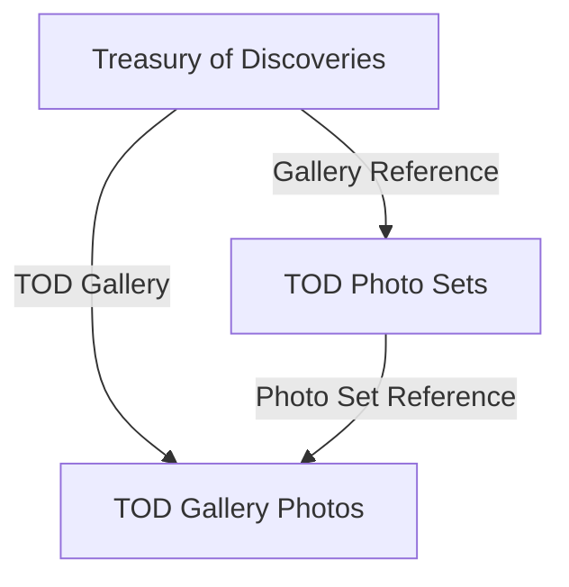

# WordPress to Webflow - Treasury of Discoveries

This repository contains the completed CMS migration tooling for moving the Kabilin Center's Treasury of Discoveries content from WordPress/extracted files into Webflow. Parent galleries, individual gallery photos, Photo Set grouping, reference resolution, image processing, review exports, retries, and resumable migration state are implemented. The remaining project work is primarily Webflow frontend styling and visual polish.

> Security: a Webflow API token used during development was previously exposed. Revoke it and issue a replacement before sharing this repository. Never commit `.env`, tokens, request headers, logs, checkpoints, or API responses.

## CMS architecture



```text
Treasury of Discoveries
└── In Love with Mary
    ├── Photo Set: Blessed Virgin
    │   ├── Gallery Photo 1
    │   ├── Gallery Photo 2
    │   └── Gallery Photo 3
    └── Photo Set: Mater Dolorosa
        ├── Gallery Photo 1
        └── Gallery Photo 2
```

`Treasury of Discoveries` is the exhibit/gallery. `TOD Photo Sets` represents one artifact or grouped subject. `TOD Gallery Photos` represents individual image records. Multiple photos reference the same set. The reverse relationship is intentionally not stored as a list on a Photo Set; Webflow builds it with a filtered Collection List.

Verified schema snapshots:

- `Treasury of Discoveries` (`treasury-of-discovery`): Gallery Name, Hero Image, introduction/content, body, Publish Date, Author, URL, Excerpt, Tags, special-feature fields, five legacy Gallery Images fields, Name, and Slug.
- `TOD Gallery Photos` (`tod-gallery-photos`): Photo, TOD Gallery, Destination URL, Sort Order, Alt Text, Caption, Description, Location, Material, Dimensions, Museum or Collection, Institution or Owner, Accession Number, Date or Century (`date-or-century-2`), Name, and Slug. The live Collection also has `Photo Set Reference`, created/reused by the Photo Set workflow; the saved schema snapshot predates that field.
- `TOD Photo Sets` (`tod-photo-sets`): Webflow's Name and Slug plus Gallery Reference (`gallery-reference`, Reference), Description (`description`, PlainText), Sort Order (`sort-order`, Number), and Cover Image (`cover-image`, Image).

See [the detailed handoff](docs/PROJECT_HANDOFF.md) for the complete field tables and relationship behavior.

## Repository map

```text
migrate.py                         CLI entry point
migration/                         migration, parsing, Webflow, and Photo Set modules
tests/                             unit tests (no live writes)
tod.csv                            parent Gallery source (10 rows)
tod-gallery-photo-descriptions.csv current Gallery Photo source (432 rows)
tod_gallery_photos.csv             legacy/intermediate Gallery Photo export
todexhibit-content-v2.xlsx         source workbook used by extractors
processed-gallery-images/          498 prepared image files plus provenance sidecars
collection-schema.json             parent schema snapshot
gallery-photos-schema.json         child schema snapshot
field-map.json                     parent mapping and image configuration
gallery-photos-field-map.json      child mapping
photo_sets_review.csv              all 238 reviewed Photo Set groups
photo_sets_singletons_review.csv   171 one-photo groups needing focused review
docs/                              handoff, cleanup, PDF, and publishing guidance
```

## Setup

Use Python 3.10 or newer (3.11 or 3.12 recommended). The code has run on macOS Python 3.9, but that installation emits a LibreSSL/urllib3 warning. Prefer a modern Homebrew or pyenv Python linked against OpenSSL.

```bash
cd webflow-migrations
python3 -m venv .venv
source .venv/bin/activate
python -m pip install --upgrade pip
python -m pip install -r requirements.txt
cp .env.example .env
```

Fill `.env` with a newly rotated token and the correct site/Collection IDs. `WEBFLOW_COLLECTION_ID` is the parent Collection; `TOD_GALLERIES_COLLECTION_ID` is a supported alias. `GALLERY_PHOTOS_COLLECTION_ID` and `TOD_GALLERY_PHOTOS_COLLECTION_ID` are aliases for the child. Do not rely on the legacy default ID embedded in the CLI; configure it explicitly.

Required source paths are relative to the project root. The active photo CSV is `tod-gallery-photo-descriptions.csv`. Its `source_path` values must resolve to readable files. Parent image discovery is configured in `field-map.json`; retain the corresponding photo directories. Do not rename or move data/photos without updating mappings and validating afterward.

## Safe workflow and exact CLI

Every CLI command loads credentials; validation and dry runs may read Webflow schemas/items. Only `migrate` and `photo-sets` without `--dry-run` may write. Never use them casually.

```bash
python3 migrate.py --help
python3 migrate.py inspect --scope all
python3 migrate.py validate --scope all
python3 migrate.py dry-run --scope all
python3 migrate.py dry-run --scope galleries --slug images-of-christ --limit 1 --batch-size 1
python3 migrate.py photo-sets --dry-run
```

`inspect` refreshes schema snapshots. `validate` checks schemas, mappings, CSV rows, filenames, references, and image constraints. `dry-run` produces payloads/checkpoints/logs without Webflow writes; these local artifacts are ignored. `photo-sets --dry-run` reads live Collections/items, validates reference targets, writes both review CSVs, and does not mutate Webflow or `.env`.

Real commands are documented for an authorized operator but were not executed during handoff:

```bash
python3 migrate.py migrate --scope all --batch-size 10
python3 migrate.py migrate --scope photos --update-existing-photos --batch-size 10
python3 migrate.py photo-sets
```

Use a narrow `--slug`/`--limit` first. Real items are created draft/staged. Checkpoint and duplicate-slug logic make reruns safe: completed records and existing slugs are reused or skipped; assets can be reused by content signature; Photo Sets reuse matching slugs and already-correct references. Do not use `--allow-existing-slugs` unless the duplicate-query tradeoff is understood. Preserve checkpoints during an active run, but do not commit them.

To regenerate source exports:

```bash
python3 extract_gallery_photos.py --help
python3 extract_gallery_photo_descriptions.py --help
```

The latest saved Photo Set review represents 433 live Gallery Photo items grouped into 238 sets: 171 singleton, 28 two-photo, 39 three-or-more, largest 14. It reports no ID-contaminated names/slugs. `photo_sets_review.csv` is the full editorial audit; `photo_sets_singletons_review.csv` isolates likely edge cases. Regenerate them only with `photo-sets --dry-run` against the intended site.

## Webflow Designer configuration

On the **TOD Photo Sets Template Page**, add a Collection List sourced from `TOD Gallery Photos`. Filter `Photo Set Reference` **equals Current TOD Photo Set**. Inside each Collection Item, add an Image bound to `Photo`; optionally bind Name, Caption, Dimensions, and other metadata. Style the list using Grid or Flex, verify responsive behavior, then publish.

On the **TOD Gallery Photos Template Page**, add a Collection List sourced from `TOD Gallery Photos`. Filter `Photo Set Reference` **equals Photo Set Reference of Current TOD Gallery Photo**. Bind each repeated Image to `Photo`. A standalone Image shows only the current record; the Collection List is what displays every photo in the same set, including the current image.

Both child types reach their parent Gallery through Gallery Reference/TOD Gallery. Bind the parent background where Webflow exposes the reference chain. Child sections may require transparent backgrounds so a body/background wrapper remains visible. Confirm this in Designer because layout/CSS behavior is not encoded in this Python repository.

## Tests and troubleshooting

```bash
python -m unittest discover -s tests -v
python3 migrate.py --help
```

- Schema mismatch: run `inspect`, compare the saved schema, and update field maps only after verifying display name, slug, type, and reference target.
- Missing parent on every photo: confirm the configured parent Collection and the child Reference field target, not just its display name.
- Partial run: keep the checkpoint, rerun the same command, and inspect results/logs locally.
- HTTP 429/5xx: the client retries with exponential/`Retry-After` delays; reduce batch size if failures persist.
- `NotOpenSSLWarning`: usually a Python environment warning, not the reason a Webflow schema request failed. Use modern Python/OpenSSL.

Full recovery guidance is in [PROJECT_HANDOFF.md](docs/PROJECT_HANDOFF.md).

## GitHub and Git LFS

The project is about 181 MB after cleanup; `processed-gallery-images/` is about 179 MB. No individual retained file approaches GitHub's 100 MB rejection limit (largest image is under 1 MB), but Git LFS is recommended and configured for common image extensions.

```bash
git lfs install
git lfs track '*.jpg' '*.jpeg' '*.png' '*.webp' '*.gif' '*.avif'
git add .gitattributes
```

Collaborators need Git LFS before cloning/pulling full images. If storing 179 MB of production images in the main repository is undesirable, use a separate LFS repository or controlled cloud archive and document the exact restore path; do not silently omit production data. See [GitHub publishing](docs/GITHUB_PUBLISHING.md).

## Remaining work

Migration logic, CMS relationships, Photo Set grouping, and data population are implemented. Remaining work is Webflow frontend styling and visual polish: final layouts, grids, responsive behavior, spacing, typography, sizing/cropping, backgrounds, navigation, cross-template consistency, and live-site testing.
