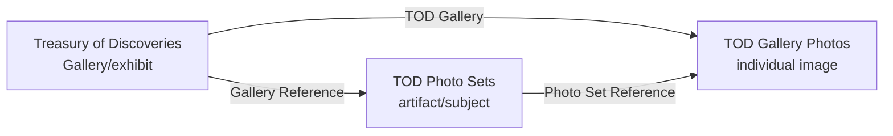

# Treasury of Discoveries CMS Migration - Project Handoff

**Project:** WordPress/extracted content to Webflow CMS  
**Handoff date:** 1 August 2026  
**Status:** Migration and CMS relationships implemented; frontend styling remains

> **Mandatory security action:** a Webflow API token used during development was exposed. Revoke it, create a replacement, and update only the ignored local `.env` before this repository is shared. The project must never contain real tokens, credentials, Authorization headers, API-response logs, or checkpoints.

---

## Executive summary

The tooling transforms ten Treasury of Discoveries galleries and their extracted image/metadata records into a relational Webflow CMS. It handles schema-aware field mapping, structured text, WordPress image variants, Webflow assets, parent and child records, references, duplicate avoidance, dry runs, retries, checkpoints, and editorial review exports.

The standard two-level Gallery-to-Photo model was insufficient because the intended site needs an artifact/subject grouping between an exhibit and its individual files. `TOD Photo Sets` provides that middle level. It allows a single artifact such as Blessed Virgin, Chasuble, or Santo Niño to own several photograph records without duplicating metadata or placing a reverse multi-reference list on the set.

The completed backend relationship is:



User-facing flow:

```text
Treasury of Discoveries Gallery page
  -> artifact / Photo Set
    -> every TOD Gallery Photo whose Photo Set Reference matches that set
```

The remaining work is Webflow frontend styling and visual polish: layouts, photo grids, responsive behavior, spacing, typography, image crop/size rules, backgrounds, navigation, template consistency, and final live-site testing.

## Repository and source inventory

| Path | Role | Commit? |
|---|---|---|
| `migrate.py` | Thin CLI entry point | Yes |
| `migration/` | Core parsing, validation, images, Webflow client, runners, Photo Sets | Yes |
| `tests/` | Unit tests; Webflow requests are mocked | Yes |
| `tod.csv` | Ten parent Gallery rows | Yes |
| `tod-gallery-photo-descriptions.csv` | Active 432-row extracted child source with structured metadata | Yes |
| `tod_gallery_photos.csv` | 432-row legacy/intermediate child source and code fallback | Yes |
| `todexhibit-content-v2.xlsx` | Source workbook for extraction | Yes |
| `processed-gallery-images/` | 498 prepared images plus 498 `.source` provenance sidecars | Yes, via Git LFS for images |
| `collection-schema.json` | Parent Collection snapshot | Yes |
| `gallery-photos-schema.json` | Gallery Photos snapshot (captured before Photo Set Reference was added) | Yes |
| `field-map.json` / `gallery-photos-field-map.json` | Source-to-Webflow mappings | Yes |
| `photo_sets_review.csv` | Full Photo Set grouping review | Yes |
| `photo_sets_singletons_review.csv` | Singleton-only editorial review | Yes |
| `.env` | Local credentials and IDs | Never |
| logs, checkpoints, results, run payloads/responses | Local generated state | Never |

`extract_gallery_photos.py` produces the legacy flat export. `extract_gallery_photo_descriptions.py` produces the richer active export by parsing descriptions into date/century, location, material, dimensions, museum/collection, institution/owner, and accession number. Extraction preserves warnings for review.

## CMS design and verified schemas

The tables below come from the saved schema snapshots and the implemented Photo Set schema. Webflow's system Name/Slug fields are included where relevant. IDs are deliberately omitted.

### Treasury of Discoveries

Display name: `Treasury of Discoveries`  
Collection slug: `treasury-of-discovery`  
Environment variable: `WEBFLOW_COLLECTION_ID` (or supported alias `TOD_GALLERIES_COLLECTION_ID`)

| Display name | Field slug | Type |
|---|---|---|
| Gallery Name | `gallery-name` | PlainText |
| Hero Image | `hero-image` | Image |
| content | `introduction` | RichText |
| body | `body-2` | RichText |
| Publish Date | `publish-date` | DateTime |
| Author | `author-2` | Reference |
| URL | `url` | PlainText |
| Excerpt | `excerpt` | RichText |
| Tags | `tags` | Reference |
| Special Feature Title | `special-feature-title` | PlainText |
| Special Feature Author | `special-feature-author` | PlainText |
| Special Features Picture | `special-features-picture` | Image |
| Special Feature Content | `special-feature-content-2` | RichText |
| Gallery Images 1-5 | `gallery-images` through `gallery-images-5` | MultiImage (legacy) |
| Name | `name` | PlainText |
| Slug | `slug` | PlainText |

Ordinary gallery photos are intentionally migrated into the child Collection. Parent payloads keep the hero and special-feature images; the legacy MultiImage fields remain in the live schema but are not the relational photo mechanism.

### TOD Photo Sets

Display name: `TOD Photo Sets`  
Collection slug: `tod-photo-sets`  
Environment variable: `TOD_PHOTO_SETS_COLLECTION_ID`

| Display name | Field slug | Type | Relationship |
|---|---|---|---|
| Name | `name` | PlainText/system | Clean artifact/subject name |
| Slug | `slug` | PlainText/system | Deterministic set slug |
| Gallery Reference | `gallery-reference` | Reference | Targets Treasury of Discoveries |
| Description | `description` | PlainText | Optional |
| Sort Order | `sort-order` | Number | Copied from first ordered photo where available |
| Cover Image | `cover-image` | Image | Copied from first ordered photo where available |

The Collection is discovered by configured ID, display name, or slug. Existing fields are validated before use. Reference target IDs may appear in Webflow's `metadata.collectionId` or `validations.collectionId`; the code supports both and fails closed if the target cannot be verified.

### TOD Gallery Photos

Display name: `TOD Gallery Photos`  
Collection slug: `tod-gallery-photos`  
Environment variable: `GALLERY_PHOTOS_COLLECTION_ID` (or `TOD_GALLERY_PHOTOS_COLLECTION_ID`)

| Display name | Field slug | Type | Relationship |
|---|---|---|---|
| Photo | `photo` | Image | Individual file |
| TOD Gallery | `tod-gallery` | Reference | Targets Treasury of Discoveries |
| Photo Set Reference | `photo-set-reference` | Reference | Targets TOD Photo Sets; live field added/reused by workflow |
| Destination URL | `destination-url` | Link | Optional source target |
| Sort Order | `sort-order` | Number | Stable ordering |
| Alt Text | `alt-text` | PlainText | Accessibility text |
| Caption | `caption` | PlainText | Display caption |
| Description | `description` | PlainText | Parsed full description |
| Location | `location` | PlainText | Parsed metadata |
| Material | `material` | PlainText | Parsed metadata |
| Dimensions | `dimensions` | PlainText | Parsed metadata |
| Museum or Collection | `museum-or-collection` | PlainText | Parsed metadata |
| Institution or Owner | `institution-or-owner` | PlainText | Parsed metadata |
| Accession Number | `accession-number` | PlainText | Parsed metadata |
| Date or Century | `date-or-century-2` | PlainText | Parsed metadata |
| Name | `name` | PlainText/system | Item name |
| Slug | `slug` | PlainText/system | Item slug |

The saved child schema predates `photo-set-reference`; verify the live schema with `inspect` before any authorized write. A Photo Set does **not** store a reverse list of photos. Webflow resolves that reverse relationship through filtering.

## Content and migration flow

1. Parent data is loaded from `tod.csv`; child data is loaded from the active descriptions CSV (or legacy fallback).
2. Rows are cleaned and validated against required columns, allowed gallery slugs, field maps, and saved/live schema types.
3. Plain text is transformed according to the target type. Rich Text becomes conservative paragraph/line-break HTML; dates are normalized to UTC ISO-8601.
4. Author and Tag source values are normalized and resolved to Webflow item IDs. Aliases such as `user`/`tkc_admin` are supported in configuration.
5. Parent image discovery recursively matches gallery folders. WordPress dimension suffixes and extraction prefixes are normalized; the highest-quality image from a resize family is selected. `G<number>` selects the hero. Special Features Picture is reserved separately. Source files are never deleted.
6. Images are validated and prepared. The processed child images are 1600x1200 where processing was needed. Upscaling is disabled unless `--allow-photo-upscaling` is explicit.
7. In dry-run mode, fake asset IDs/URLs and payloads are produced locally. In real mode, assets are uploaded/associated and draft/staged CMS items are created.
8. Parent item IDs resolve `TOD Gallery` references for child records. Missing or ambiguous references fail validation rather than guessing.
9. Duplicate slugs, completed checkpoints, asset content signatures, and existing Photo Set slugs support idempotent reruns.
10. Requests use retry handling for 429 and transient 5xx responses, respecting `Retry-After` or exponential delay. Batches are constrained to Webflow limits.

### Photo Set stage

The Photo Set workflow reads live parent galleries and Gallery Photos, resolves the one child Reference field that targets the configured parent Collection, then groups on `(parent Gallery item ID, normalized Photo Set identity)`. Including the parent in the key prevents a subject with the same name from crossing Gallery boundaries.

Identity comes first from a usable CMS Name. Generated names, filenames, generic `Photo N` labels, or ID-dominated values are rejected. Otherwise the workflow derives a set name from original filename/image metadata/fallback filename. It removes known generated prefixes and only strips trailing numeric sequences when sibling evidence proves the number is a sequence. Ambiguous suffixes stop a real run. Deterministic slugs are disambiguated by Gallery when the same base slug occurs in multiple parents.

Safety gates reject:

- malformed or empty identities;
- Webflow 24-character item IDs in names or slugs;
- unresolved/ambiguous numeric suffixes;
- an existing Photo Set slug pointing at a different Gallery;
- a pre-existing Photo Set Reference with the wrong type/target;
- a singleton ratio above 80% in real mode (a signal that grouping is ineffective);
- a photo already linked to a different set.

The workflow creates or reuses the Collection/field/set items as needed, assigns a cover image and order from the first photo, and minimally updates only missing Photo Set references. Already-correct links are counted and left untouched.

### Latest saved grouping evidence

The review CSVs (generated 31 July 2026) contain:

| Metric | Value |
|---|---:|
| Gallery Photo items represented | 433 |
| Unique Photo Sets | 238 |
| Single-photo sets | 171 |
| Two-photo sets | 28 |
| Sets with 3+ photos | 39 |
| Largest set | 14 |
| Webflow-ID-contaminated generated identities | 0 |

The 433 total is one higher than the 432-row local source CSV because the dry-run groups current live CMS items. A read-only dry run on 1 August 2026 confirmed all 238 sets were reused, all 433 photos were already linked, and there were zero missing parents, invalid filenames, slug collisions, ambiguous groups, or generated-ID-contaminated identities. Reconfirm on the target site after any CMS edit.

`photo_sets_review.csv` is the complete grouping ledger, including Gallery, set, counts, item IDs, evidence source, confidence, singleton flag, and warnings. `photo_sets_singletons_review.csv` is the focused editorial queue for one-photo groups; it is not a different migration input.

## CLI and operational safety

```bash
python3 migrate.py --help
python3 migrate.py inspect --scope all
python3 migrate.py validate --scope all
python3 migrate.py dry-run --scope all
python3 migrate.py photo-sets --dry-run
```

All commands require `.env` because even offline-looking validation initializes clients and may compare against Webflow. `inspect`, `validate`, both dry-run forms, and Photo Set dry-run may read the API. The safe handoff rule is: **never run `migrate` or `photo-sets` without `--dry-run` unless a named operator has approved a production mutation.**

Real commands, for authorized use only:

```bash
python3 migrate.py migrate --scope all --batch-size 10
python3 migrate.py migrate --scope photos --update-existing-photos --batch-size 10
python3 migrate.py photo-sets
```

Useful scoping flags include `--slug`, `--limit`, `--start-row`, `--scope`, `--batch-size`, and explicit checkpoint/results/log paths. `--refresh-schema` performs a live schema fetch. `--allow-existing-slugs` bypasses the duplicate-slug query and is not recommended.

Dry-run state, results, payload/response logs, and checkpoints are generated locally and ignored. During an interrupted active migration, keep its checkpoint until recovery is complete; after final reconciliation, archive it securely outside Git or remove it.

## Reference resolution and schema changes

Never map a Reference field by display name alone. Confirm field slug, field type, and target Collection ID. Webflow has returned target IDs in both of these shapes:

```json
{"metadata": {"collectionId": "TARGET_COLLECTION_ID"}}
```

```json
{"validations": {"collectionId": "TARGET_COLLECTION_ID"}}
```

The Photo Set implementation checks both. If neither is present, it cannot prove safety and stops.

To modify a mapping safely:

1. Back up current field maps and export the live schema with `inspect`.
2. Confirm the target display name, slug, type, requiredness, and reference target.
3. Change the smallest relevant entry in `field-map.json` or `gallery-photos-field-map.json`.
4. Update fixture/test expectations if the intended schema changed.
5. Run unit tests, `validate`, and a one-record dry run.
6. Inspect the payload; only then schedule an authorized narrow real run.

To add or rename a Webflow field, create/rename it in Webflow first, refresh the schema, then update mappings to the **slug returned by Webflow**. Display-name changes do not guarantee slug changes. Do not alter the Photo Set reference target or existing live Collections through ad hoc scripts.

For PlainText fields, keep the value single-line if Webflow's current field validation demands it. Multiline descriptions may require a RichText or properly configured multi-line field in Webflow; change the schema intentionally rather than flattening content silently. `Dimensions` is PlainText in the verified snapshot, so numeric/object payloads will fail.

## Webflow Designer setup

### TOD Photo Sets Template Page

1. Add a Collection List.
2. Source: `TOD Gallery Photos`.
3. Filter: `Photo Set Reference` **equals Current TOD Photo Set**.
4. Inside the Collection Item, add an Image and bind it to `Photo`.
5. Optionally bind Name, Caption, Dimensions, Date or Century, Location, or other metadata.
6. Configure Grid/Flex, responsive columns, gaps, crop behavior, and accessibility text.
7. Verify the expected images, then publish.

### TOD Gallery Photos Template Page

To show every image in the current item's set:

1. Add a Collection List.
2. Source: `TOD Gallery Photos`.
3. Filter: `Photo Set Reference` **equals Photo Set Reference of Current TOD Gallery Photo**.
4. Add an Image to each Collection Item and bind it to `Photo`.

This list includes the current image. One standalone Image element only displays the current Gallery Photo; repetition requires the Collection List.

### Parent background

Photo Set and Gallery Photo records can reach their parent through Gallery Reference/TOD Gallery. Where Designer exposes the reference chain, bind the relevant parent background/hero field to the page wrapper. Child sections may need transparent backgrounds for the body or wrapper background to remain visible. Confirm stacking, overlays, image loading, and CSS in Designer and on the published site; this repository cannot verify those visual rules.

## Troubleshooting

| Symptom/error | Likely cause | Safe response |
|---|---|---|
| `collection does not contain any items` | Wrong Collection ID/site or genuinely empty Collection | Check site and Collection display name/slug in `inspect`; do not create placeholder items. |
| Reference field points to a different Collection | Wrong field or changed target | Compare `metadata.collectionId` and `validations.collectionId`; stop and correct configuration/schema. |
| All items reported as missing parent | Wrong parent Collection ID, wrong child Reference slug, or unexpected reference value shape | Inspect the resolved field log and a redacted item's `fieldData`; verify target and IDs. |
| Nearly one Photo Set per image | CMS names are unique photo labels or filename suffix removal lacks evidence | Review grouping source/confidence and singletons; improve source naming/evidence, then dry-run again. |
| Description expected to be single line | Target is PlainText/single-line validation but input contains line breaks | Confirm live field type; intentionally change Webflow field or sanitize via an approved mapping change. |
| Dimensions validation failure | Non-string value or wrong field slug/type | Use verified slug `dimensions` and a PlainText value; refresh schema. |
| CMS image/background appears black | Designer overlay/background, opaque child section, unsupported binding, or image issue | Inspect the asset URL, remove overlays temporarily, make child wrappers transparent, and test published output. |
| Wrong Reference field slug | Display name was mistaken for API slug | Refresh schema and use the exact `slug`; never guess. |
| Webflow item IDs in Photo Set names | Generated filenames were used without cleaning | Current safety gate refuses writes; fix source identity and rerun dry-run. |
| Partial migration after interruption | Network/process interruption after some drafts/assets | Preserve checkpoint/results/logs locally, inspect Webflow drafts, then rerun the identical scoped command; idempotency reuses/skips completed work. |
| HTTP 429 or intermittent 5xx | Webflow rate limit/transient outage | Allow built-in retry/`Retry-After`, reduce batch size, and resume from checkpoint. |
| `NotOpenSSLWarning: urllib3 v2...LibreSSL` | macOS system Python uses old LibreSSL | Usually environmental, not a schema failure. Use Homebrew/pyenv Python 3.11+ linked to OpenSSL; inspect the actual subsequent HTTP/schema error. |

### Recovery procedure

1. Stop further writes and record the exact command/scope.
2. Preserve local checkpoint/results/logs outside Git.
3. Inspect Webflow draft items, slugs, parent references, and Photo Set references without publishing.
4. Compare checkpoint completed slugs/item IDs with live CMS state.
5. Correct configuration/data only after identifying the cause.
6. Run unit tests, validation, and the same narrow dry run.
7. Resume with the same checkpoint and scope. Do not delete live items merely to obtain a clean rerun.

## Manual final CMS verification

- Confirm all ten parent galleries exist with correct Name/Slug, content, hero, special-feature fields, Author, and Tags.
- Confirm Gallery Photos point to the intended parent via `TOD Gallery`.
- Confirm Photo Sets point to the intended parent via `Gallery Reference`.
- Sample singleton, two-photo, large, and cross-Gallery same-name cases.
- Confirm every sampled Gallery Photo's `Photo Set Reference` targets the expected set.
- Confirm set cover/order values are sensible.
- Check alt text, captions, parsed descriptions, dimensions, provenance, and missing-image cases.
- Validate both template filters and ensure the current image appears once in the repeated list.
- Test desktop/tablet/mobile layouts and published, not only Designer, behavior.
- Publish only after stakeholder approval.

## Security and GitHub publication

`.env` is ignored and `.env.example` contains empty placeholders only. Generated logs, API responses, checkpoints, and results are ignored because they may expose CMS IDs/content or operational details. Rotate the old token before staging. Scan the exact staged set; a workspace scan should report only intentional test fixture header text and placeholder/documentation names, never a credential value.

The cleaned project is approximately 181 MB. Prepared images account for about 179 MB; the largest observed image is under 1 MB, so no file violates GitHub's 100 MB limit. Git LFS is nevertheless configured for image extensions to keep binary history manageable. See `docs/GITHUB_PUBLISHING.md` for exact commands and alternatives.

## Handoff checklist

- [ ] Old Webflow token revoked; replacement stored only in ignored `.env`.
- [ ] Site and all three Collection IDs confirmed.
- [ ] `python -m unittest discover -s tests -v` passes.
- [ ] CLI help succeeds.
- [ ] `validate --scope all` succeeds against the intended site.
- [ ] Narrow gallery dry run reviewed.
- [ ] `photo-sets --dry-run` reviewed; zero missing/invalid/ambiguous/collision counts confirmed live.
- [ ] Both review CSVs approved editorially.
- [ ] Git LFS installed and image attributes verified.
- [ ] Exact staged content scanned for secrets.
- [ ] Webflow Photo Set and Gallery Photo Template Page filters configured.
- [ ] Parent background behavior verified.
- [ ] Responsive frontend styling and live-site QA completed.
- [ ] No real migration executed merely for handoff/publication.

---

**Implementation boundary:** CMS migration, relationships, Photo Set grouping, and data population are implemented. The next developer should focus primarily on Webflow frontend styling and visual polish, not rewrite the migration.
